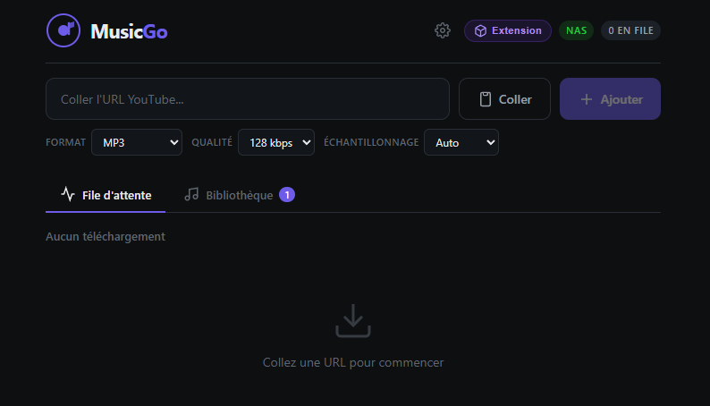
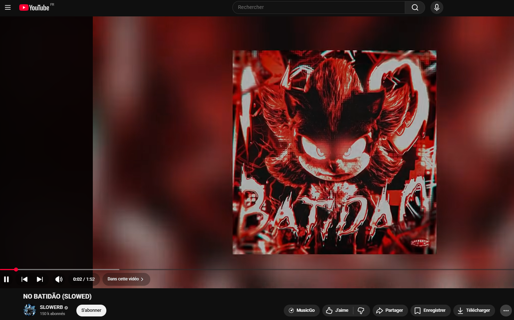

<div align="center">



# MusicGo

**Téléchargez vos musiques en qualité studio, depuis votre navigateur.**

[](https://python.org)
[](https://fastapi.tiangolo.com)
[](https://vitejs.dev)
[](https://github.com/yt-dlp/yt-dlp)
[](LICENSE)

</div>

---

## Présentation

MusicGo est une application web auto-hébergée qui télécharge n'importe quelle URL (YouTube, Spotify, SoundCloud, TikTok, Deezer, Apple Music) en fichier audio de qualité maximale.

Interface sombre et réactive, file d'attente avec progression en temps réel, pochette automatique, et une extension navigateur qui ajoute un bouton de téléchargement directement dans YouTube.

> **Usage personnel uniquement.** Respectez les droits d'auteur et les conditions d'utilisation des plateformes.

---

## Captures d'écran

<table>
<tr>
<td align="center" width="50%">

<br/><sub><b>Interface principale</b></sub>
</td>
<td align="center" width="50%">

<br/><sub><b>Extension dans la barre YouTube</b></sub>
</td>
</tr>
</table>

---

## Fonctionnalités

### Téléchargement
- **Multi-sources** — YouTube, SoundCloud, TikTok via yt-dlp · Spotify, Deezer, Apple Music via spotdl
- **Formats** — MP3 / FLAC / WAV / OGG / M4A / OPUS / MP4
- **Pochette automatique** — miniature YouTube embarquée dans les métadonnées (ID3, FLAC Picture, MP4 Cover)
- **Téléchargements parallèles** — plusieurs pistes simultanées (configurable)
- **File d'attente** — ajoutez plusieurs URLs, progression live phase par phase

### Interface
- Thème sombre soigné, entièrement responsive
- Bibliothèque groupée par jour avec compteur
- Suppression par jour ou en masse
- Coller depuis le presse-papiers en un clic
- Animation confetti + son à chaque téléchargement réussi

### Qualité audio
| Format | Qualité max | Usage recommandé |
|--------|-------------|------------------|
| MP3    | 320 kbps    | Usage général, compatible partout |
| FLAC   | Lossless    | Archivage haute fidélité |
| WAV    | Lossless    | Production musicale |
| OPUS   | 320 kbps    | Streaming, fichiers légers |
| M4A    | 320 kbps    | Écosystème Apple |

### Extension navigateur (Chrome / Edge)
- Bouton **MusicGo** intégré dans la barre YouTube, à côté du logo
- Choix du format et de la qualité directement dans le popup
- Envoi en un clic dans la file de téléchargement
- Lancement one-click depuis MusicGo : ouvre Chrome/Edge avec l'extension déjà active

### Installeur Windows autonome
- `.exe` tout-en-un : Python embarqué + ffmpeg + yt-dlp + frontend buildé
- Aucune dépendance à installer sur la machine cible
- Chromium portable téléchargé automatiquement au premier lancement
- Mode réparation / désinstallation intégré

---

## Installation

### Prérequis

- **Python 3.11+**
- **Node.js 18+**
- **[ffmpeg](https://ffmpeg.org/download.html)** dans le PATH
- **[spotdl](https://github.com/spotDL/spotify-downloader)** (optionnel — pour Spotify / Deezer / Apple Music)

### 1. Cloner le projet

```bash
git clone https://github.com/SimplementJohn/MusicGo.git
cd musicgo
```

### 2. Dépendances Python

```bash
pip install -r requirements.txt
```

### 3. Dépendances Node

```bash
npm install
```

### 4. Configuration (optionnel)

Créez un fichier `.env` à la racine :

```env
HOST=127.0.0.1
PORT=8080
MAX_PARALLEL_DOWNLOADS=2
OUTPUT_FORMAT=mp3
AUDIO_QUALITY=320
```

---

## Lancement

### Mode développement

```bash
# Terminal 1 — Backend (port 8080)
python app.py

# Terminal 2 — Frontend hot-reload (port 3000)
npm run dev
```

Ouvrir **http://localhost:3000**

### Mode production

```bash
npm run build
python app.py
```

Ouvrir **http://localhost:8080**

### Script Linux / macOS

```bash
chmod +x install.sh
./install.sh
```

---

## Extension navigateur

### Option A — One-click *(recommandé)*

1. Ouvrir MusicGo → cliquer **Extension** dans le header
2. Cliquer **"Lancer avec l'extension"**
3. Chrome ou Edge s'ouvre avec le bouton déjà actif dans YouTube ✓

### Option B — Installation manuelle

1. Ouvrir `chrome://extensions` ou `edge://extensions`
2. Activer le **Mode développeur**
3. Cliquer **"Charger l'extension non empaquetée"**
4. Sélectionner le dossier `extension/` du projet
5. Se rendre sur une vidéo YouTube → le bouton **MusicGo** apparaît dans la barre

---

## Installeur Windows

Pour distribuer MusicGo comme application Windows autonome (`.exe`) :

```powershell
cd installer
.\build-all.ps1
```

Prérequis supplémentaires : [Inno Setup 6](https://jrsoftware.org/isdl.php)

```powershell
winget install -e --id JRSoftware.InnoSetup
```

Le script génère automatiquement `installer/output/MusicGo-Setup-X.Y.Z.exe`.
Voir [`installer/README.md`](installer/README.md) pour les détails.

---

## Paramètres

Cliquer sur **⚙** dans le header.

| Identifiant par défaut | Mot de passe par défaut |
|------------------------|-------------------------|
| `admin`                | `admin`                 |

| Onglet | Réglages |
|--------|----------|
| **Stockage** | Dossier de sauvegarde local |
| **Audio** | Format, qualité et échantillonnage par défaut |

> La session expire automatiquement à la fermeture du panneau.

---

## Référence API

| Méthode | Route | Description |
|---------|-------|-------------|
| `POST`   | `/api/analyze`            | Analyser une URL |
| `POST`   | `/api/queue/add`          | Ajouter des pistes à la file |
| `GET`    | `/api/queue`              | État de la file |
| `DELETE` | `/api/queue/{id}`         | Annuler / supprimer |
| `DELETE` | `/api/queue`              | Vider la file |
| `GET`    | `/api/library`            | Bibliothèque des fichiers |
| `DELETE` | `/api/library`            | Vider la bibliothèque *(auth)* |
| `POST`   | `/api/library/remove`     | Supprimer des entrées *(auth)* |
| `POST`   | `/api/library/open`       | Ouvrir dans l'explorateur |
| `POST`   | `/api/auth/login`         | Authentification |
| `GET`    | `/api/settings`           | Lire la configuration |
| `POST`   | `/api/settings`           | Modifier la configuration |
| `GET`    | `/api/extension/download` | Télécharger l'extension en `.zip` |
| `POST`   | `/api/extension/launch`   | Lancer Chrome/Edge avec l'extension |
| `WS`     | `/ws`                     | Progression en temps réel |

---

## Structure du projet

```
musicgo/
├── app.py                  # Backend FastAPI + pipeline de téléchargement
├── requirements.txt        # Dépendances Python
├── vite.config.js          # Configuration Vite
├── package.json
│
├── src/                    # Frontend Vite (Vanilla JS)
│   ├── main.js             # UI principale
│   ├── style.css           # Thème sombre
│   ├── api.js              # Helpers fetch
│   ├── websocket.js        # WebSocket avec reconnexion auto
│   ├── icons.js            # Icônes SVG par source
│   ├── toast.js            # Notifications
│   └── utils.js            # Fonctions utilitaires
│
├── extension/              # Extension Chrome / Edge (Manifest V3)
│   ├── manifest.json
│   ├── content.js          # Injection du bouton dans YouTube
│   ├── content.css
│   └── background.js       # Service worker — relais API
│
├── installer/              # Build installeur Windows
│   ├── build-all.ps1       # Orchestrateur complet
│   ├── build-installer.ps1 # Préparation du bundle
│   ├── musicgo-setup.iss   # Script Inno Setup
│   ├── generate-icon.py    # Génération des icônes
│   ├── license.txt
│   └── launcher/
│       ├── musicgo_launcher.py   # Lance backend + Chromium portable
│       └── launcher_hidden.vbs   # Fallback VBS (sans csc.exe)
│
├── public/                 # Assets statiques (copiés dans dist/)
├── screenshots/
└── install.sh              # Script d'installation Linux / macOS
```

---

## Stack technique

| Composant | Technologie |
|-----------|-------------|
| Backend   | Python 3.11 · FastAPI · uvicorn · yt-dlp · spotdl · ffmpeg · mutagen |
| Frontend  | Vite 6 · Vanilla JS · WebSocket natif · CSS custom properties · canvas-confetti |
| Extension | Manifest V3 · Content Script · Service Worker |
| Installeur | Inno Setup 6 · Python embedded · C# stub launcher |

---

## Sécurité

- Conçu pour un usage sur **réseau local** uniquement (`HOST=127.0.0.1` par défaut)
- Auth : PBKDF2-HMAC-SHA256 200 000 itérations + `hmac.compare_digest` (timing-safe)
- Tokens : `secrets.token_urlsafe(32)` · TTL 2h · purge automatique
- SSRF guard : whitelist stricte des hôtes autorisés — bloque `localhost`, plages RFC 1918, `file://`
- CORS : whitelist `localhost:{3000,8080}` + regex `chrome-extension://` / `moz-extension://`

---

## Licence

MIT — voir [LICENSE](LICENSE)

> Fait avec ♥ et beaucoup de musique
